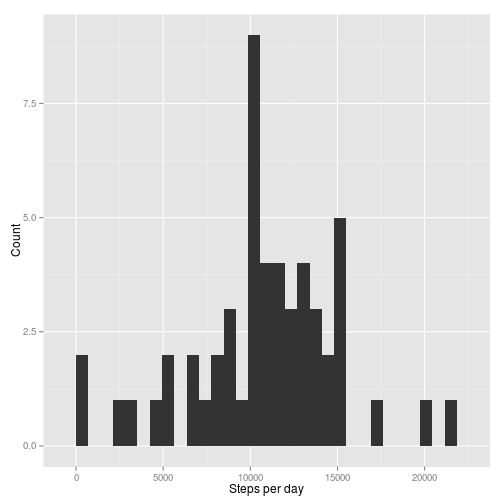
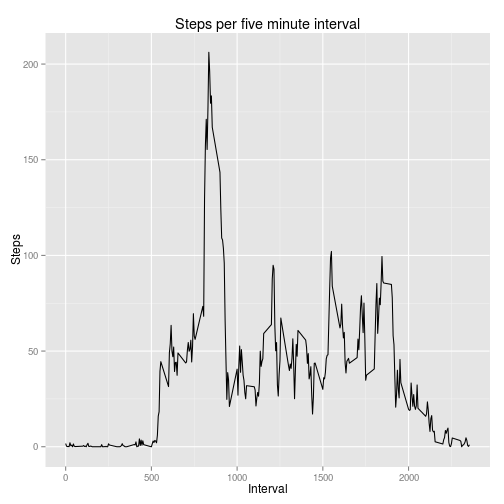
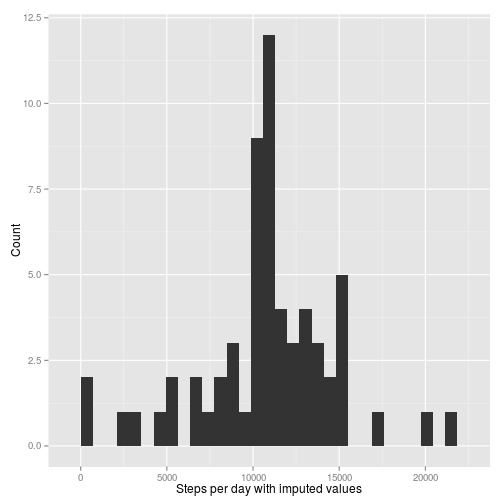
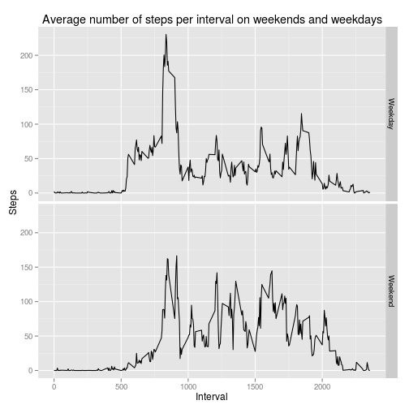

# Reproducible Research: Peer Assessment 1


```r
library(ggplot2)
```

## Loading and preprocessing the data


```r
if (!file.exists('activity.csv')) unzip('activity.zip')
activity_df <- read.csv('activity.csv',
                        colClasses = c("integer", "Date", "integer"))
```

## What is mean total number of steps taken per day?


```r
by_day <- aggregate(steps ~ date, activity_df, sum)
hist_plot1 <- ggplot(by_day, aes(steps)) +
    geom_histogram() +
    labs(x = 'Steps per day', y = 'Count')
step_mean <- mean(by_day$steps)
step_median <- median(by_day$steps)
suppressMessages(print(hist_plot1))
```

 

The mean and median number of steps per day are, respectively, 10766 and 10765.

## What is the average daily activity pattern?

Average by five minute interval across days:


```r
by_interval <- aggregate(steps ~ interval, activity_df, mean)
ggplot(by_interval, aes(interval, steps)) +
    geom_line() +
    labs(x = 'Interval', y = 'Steps', title = 'Steps per five minute interval')
```

 

```r
head(by_interval)
```

```
##   interval   steps
## 1        0 1.71698
## 2        5 0.33962
## 3       10 0.13208
## 4       15 0.15094
## 5       20 0.07547
## 6       25 2.09434
```


```r
max_steps_index <- which(by_interval$steps == max(by_interval$steps))
max_steps_interval <- by_interval[max_steps_index,1]
```

The five minute interval which has the maximum average number of steps is 835.

## Imputing missing values

The number of observations with missing step information (`steps == NA`) is:


```r
sum(is.na(activity_df$steps))
```

```
## [1] 2304
```

A reasonable strategy for filling in these missing values is to use, for any missing value in a given interval, the mean number steps observed during that interval on other days.


```r
impute_by_interval <- function(step, interval, by_interval_df) {
    # If `step` is `NA`, replace with the numker of steps in interval `interval` in the df `by_interval_df-
    step <- as.integer(step)
    interval <- as.integer(interval)
    if (is.na(step)) return(by_interval_df[which(by_interval_df$interval == interval), ]$steps)
    step
}
```

Use this strategy to fill in the missing values:


```r
imputed_steps <- apply(activity_df, 1, function(x) impute_by_interval(x[1], x[3], by_interval))
imputed_activity_df <- activity_df
imputed_activity_df$steps <- imputed_steps
```

Aggregate by date to get the estimated total number of steps taken each day:


```r
imputed_by_day <- aggregate(steps ~ date, imputed_activity_df, sum)
hist_plot2 <- ggplot(imputed_by_day, aes(steps)) +
    geom_histogram() +
    labs(x = 'Steps per day with imputed values', y = 'Count')
imputed_step_mean <- mean(imputed_by_day$steps)
imputed_step_median <- median(imputed_by_day$steps)
summary_table <- rbind(summary(imputed_by_day$steps, digits = 10),
                       summary(by_day$steps, digits = 10))
rownames(summary_table) <- c('With imputed values', 'With missing values')
suppressMessages(print(hist_plot2))
```

 

The mean and median number of steps per day are, respectively, 10766 and 10766. The following table gives the summary statistics for the number of steps per day with and without the imputed values:


```r
summary_table
```

```
##                     Min. 1st Qu. Median  Mean 3rd Qu.  Max.
## With imputed values   41    9819  10766 10766   12811 21194
## With missing values   41    8841  10765 10766   13294 21194
```

Imputing the missing values barely changes the distribution of steps per day. The median number of steps per day decreases by ten with the imputed values. The mean does not change. Comparing the histograms with and without the imputed values, we can see that the imputing the values increases the frequency of a given number of steps per day.

## Are there differences in activity patterns between weekdays and weekends?


```r
is_weekend <- function(day_of_week) {
    if (day_of_week %in% c('Saturday', 'Sunday')) return('Weekend')
    'Weekday'
}

weekday_or_weekend <- sapply(weekdays(imputed_activity_df$date), is_weekend, USE.NAMES = F)
activity_by_weekday_or_weekend <- aggregate(steps ~ interval + weekday_or_weekend,
                                            data = cbind(imputed_activity_df, weekday_or_weekend),
                                            mean)
```


```r
ggplot(activity_by_weekday_or_weekend, aes(interval, steps)) +
    geom_line() +
    facet_grid(weekday_or_weekend ~ .) +
    labs(title = 'Average number of steps per interval on weekends and weekdays',
         x = 'Interval',
         y = 'Steps')
```

 

There do appear to be differences in the number of steps per five minute interval depending on whether the day is a weekday. Activity on weekends is more uniform across the waking day while activity on weekdays clumps around the start and end of the workday with a few spikes during the day. Overall, this person appears more active on weekends. Indeed, this is reflected in both the average number of steps across all intervals:


```r
with(activity_by_weekday_or_weekend, tapply(steps, weekday_or_weekend, mean))
```

```
## Weekday Weekend 
##   35.61   42.37
```

and in the total number of steps taken per day:


```r
with(activity_by_weekday_or_weekend, tapply(steps, weekday_or_weekend, sum))
```

```
## Weekday Weekend 
##   10256   12202
```
